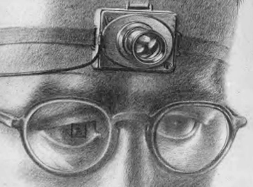

<h1>"As We May Think" Exercise</h1>

In the Brightspace Discussions tool, answer one of the questions below based on the reading by Vanavar Bush, and comment on a fellow student's post. Your posted answer should be approximately _75 - 100 words_, and the comment, a sentence or two. 

- It's a short title for such an  influential paper, what did he mean by it?
- What are some technologies that he predicted that did come true? Give an example, and what are its benefits and/or shortcomings.
- He talks about &quot;indexing&quot;, has this come to past? What's an example of where it has been used?
- With his prediction of the &quot;Memex&quot;, give an example and description of how that has come into being.
- The camera idea must have seemed like science fiction at the time, how has that come to pass?
- In one illustrative example, how do you think Artificial Intelligence has or will surpass Bush's wildest predictions?

- Please briefly comment on one of your fellow classmate's post on the reading.
- <a href="http://worrydream.com/refs/Bush%20-%20As%20We%20May%20Think%20%28Life%20Magazine%209-10-1945%29.pdf" target="_blank">As We May Think PDF</a> or <a href="https://www.theatlantic.com/magazine/archive/1945/07/as-we-may-think/303881/" target="_blank">HMTL</a> [Bush 1945]

**Exercise Due Sunday, June 1st by midnight**

 
