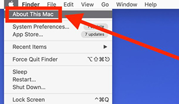

<h1>Install the Renamer and PhotoScape</h1>

- Make sure your folder of images has been backed up or are not important! Following the two videos in Unit 4 (Renamer and Batch edit with PhotoScape), and complete a similar task on your own. 
- Once installed, post a comment to the Unit 4 exercise discussion forum. Just a “great success” is fine or if you want to write more or ask questions, please do. 
- Of course, if you have issues, please post them as well.
- Please note, that unfortunately, both applications have a different looks for both PC and Mac. They more or less have the same funtionality. 

Install software:
- <a href="http://www.den4b.com/?x=products&product=renamer" target="_blank">Renamer (PC)</a>
- <a href="https://renamer.com/" target="_blank">Renamer (for Mac)</a>
- <a href="https://renamer.com/support.html" target="_blank">Renamer (for Mac **older versions**)</a> be sure to scroll to the bottom.
- <a href="http://x.photoscape.org/" target="_blank">PhotoScape for Mac and Win</a> 

- **Attention Mac Users** Please don't upgrade your system merely to download and use Renamer. It's not necessary because they have older compatible versions that will work fine on your current system. 

- <a href="https://renamer.com/support.html" target="_blank">Older versions of Renamer for Mac--scroll down. Do not pay for this, there should be a trial option that will last through the course</a>  

- Check your current OS by clicking on the Apple icon in the upper left corner of the screen. 

  
**Due: June 9th at 9am**